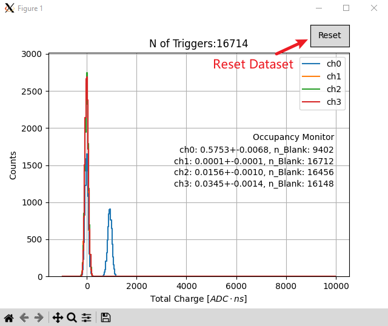

# WaveDump Live Monitor
Method learned from robjfoster's git@github.com:robjfoster/wavedumplivepsd.git and using WaveDump reader in robjfoster's repository

In time profile measurement, to monitor the charge distribution and occupancy of the waveform data from the digitizer in real time.

## Usage 
0. Clone this repository:`git clone https://github.com/jack595/WaveDumpOnline.git`
1. Clone reader for Wavedump under WaveDumpOnline directory : `cd WaveDumpOnline && git clone https://github.com/robjfoster/gimmedatwave.git` 
2. Run the monitor: `python WavedumpChargeOnlineMonitor.py --input-directory /mnt/f/Data_dEdxExperiment/Data_N6742/405nmLaser_test_pulse_width/ --digitizer X742`

## Parameters
* `--input-directory` is the directory where the data is being written to by the digitizer, monitor will look for *.dat in this directory
* `--digitizer` is the digitizer being used, here only list X742 as example. Input can be X742, X740, X730, X725, X751

**Parameters for Occupancy**
* `--threshold-ADC` is the threshold of maximum of waveform
* `--threshold-peak-valley-ratio` is the threshold of peak-valley ratio:

$$ max+min \over max $$

* `--threshold-charge` is the threshold of the sum of the waveform.
So blank event definition: (max < threshold_ADC) or ( (max+min)/min < threshold_peak_valley_ratio) or (sum < threshold_charge)

**Optional Switcher**
* `--bin-start, --bin-end, --nbins` is the binning strategy. Configure the online charge binning for plot: `bin=np.linspace(bin_start, bin_end, nbins)`

## Occupancy Calculation

$$ \mu=-log{n_{Blank} \over n_{Total} }$$

$$ \sigma=\sqrt{ (1-exp{(-\mu)}) \over (n_{Total}*exp{(-\mu)}) } $$

## GUI Interface
The Interface is shown as below:

